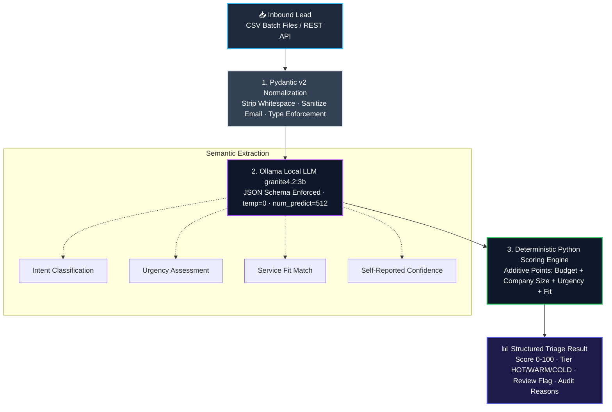

<div align="center">

# 🚀 LeadPilot

### **Production-Grade, Local-First AI Lead Qualification & Triage Engine**
*100% Private · Zero Cloud Costs · Deterministic Python Scoring · Resumable Batch Processing*

<br/>

[](LICENSE)
[](https://www.python.org/)
[](https://fastapi.tiangolo.com/)
[](https://docs.pydantic.dev/)
[](https://ollama.com/)
[]()

<br/>

[**⚡ Quick Start**](#-quick-start) •
[**✨ Key Features**](#-key-features) •
[**🏗️ Architecture**](#️-system-architecture) •
[**📊 Scoring Logic**](#-scoring-rules--rubric) •
[**📁 Batch Processing**](#-how-to-run) •
[**📈 Excel Reports**](#output-files-structure) •
[**💼 Enterprise Setup**](#-commercial--custom-deployment)

<br/>

---

</div>

<br/>

## 🌟 Overview

**LeadPilot** bridges the gap between **unstructured customer inquiries** and **actionable sales prioritization**. It analyzes inbound leads using a **local, on-device Large Language Model** (`granite4.2:3b` via Ollama) and pairs it with a **strict, deterministic Python scoring algorithm**.

No lead data ever leaves your hardware. No monthly OpenAI API bills. No brittle multi-step Zapier or n8n webhooks.

> [!IMPORTANT]
> **Data Privacy by Default:** Designed for compliance-heavy industries (finance, healthcare, legal, B2B SaaS) where transmitting customer inquiries, budgets, and contact info to external cloud LLMs violates privacy policies.

<br/>

---

## 🥊 Why LeadPilot?

| Capability | ☁️ Traditional Cloud Stack (Zapier / n8n + OpenAI) | 🚀 **LeadPilot (Local Engine)** |
|:---|:---:|:---:|
| **Data Privacy** | ❌ Data sent to 3rd-party US cloud servers | 🛡️ **100% On-Premise / Localhost** |
| **API Costs** | 💸 Pay per token / monthly subscription tiers | 🆓 **\$0.00 forever** (Runs on local GPU/CPU) |
| **Scoring Consistency** | 🎲 LLMs hallucinate numbers & change scores | 📐 **Deterministic Python Rule Engine** |
| **Batch Resilience** | ⚠️ Webhooks timeout & fail silently | 🔄 **Atomic Checkpoint & Auto-Resume** |
| **Spreadsheet Safety** | ⚠️ Vulnerable to CSV Formula Injection | 🔒 **Automatic Excel sanitization (`=`, `+`, `-`, `@`)** |
| **External Dependency** | ❌ Breaks if cloud provider goes down | 💻 **Runs 100% offline** |

<br/>

---

## 🏗️ System Architecture

LeadPilot strictly separates **semantic language understanding** from **business decision logic**:



<br/>

---

## ✨ Key Features

<table>
  <tr>
    <td width="50%">
      <h3>⚡ Resumable Batch CSV Engine</h3>
      <ul>
        <li>Process thousands of leads sequentially without VRAM spikes.</li>
        <li><b>Stateful Checkpointing:</b> Interrupted jobs resume instantly; completed rows are skipped.</li>
        <li><b>Native Windows Dialogs:</b> Double-click to pick files or whole folders.</li>
        <li><b>CSV Formula Defense:</b> Automatically escapes potential injection payloads.</li>
      </ul>
    </td>
    <td width="50%">
      <h3>🎯 Hybrid Intelligence Engine</h3>
      <ul>
        <li><b>Semantic parsing:</b> Understands Indonesian & English intent nuances.</li>
        <li><b>Zero hallucination on numbers:</b> Calculations handled by hard-coded Python math, not probabilistic generation.</li>
        <li><b>Auto-Audit Trail:</b> Returns explicit justification strings for every point awarded.</li>
      </ul>
    </td>
  </tr>
  <tr>
    <td width="50%">
      <h3>🔌 Developer-First REST API</h3>
      <ul>
        <li>Fully documented OpenAPI / Swagger schema at <code>/docs</code>.</li>
        <li>Strict error boundaries (422 validation, 502 bad format, 503 unavailable, 504 timeout).</li>
        <li>High test coverage (98 unit tests + live Ollama smoke test).</li>
      </ul>
    </td>
    <td width="50%">
      <h3>🧪 Deterministic, Auditable Scoring</h3>
      <ul>
        <li>Additive rule engine (budget, company size, fit, urgency, intent).</li>
        <li>Every point awarded ships with a human-readable reason string.</li>
        <li>Automatic human-review flag when model confidence drops below 0.60.</li>
      </ul>
    </td>
  </tr>
</table>

<br/>

---

## 📊 Scoring Rules & Rubric

Scores are computed deterministically on a scale of **0 to 100**:

```
TOTAL SCORE = Budget Points + Company Size Points + Service Fit + Urgency + Strong Intent
```

| Signal / Attribute | Criteria | Points |
|---|---|:---:|
| 💰 **Budget (IDR)** | $\ge$ Rp 5,000,000 | **+30** |
| | $\ge$ Rp 2,000,000 and < Rp 5,000,000 | **+20** |
| | $>$ Rp 0 and < Rp 2,000,000 | **+10** |
| 🏢 **Company Size** | 20 – 200 employees (Sweet spot) | **+20** |
| | $\ge$ 5 employees (including > 200) | **+10** |
| 🛠️ **Service Fit** | Matches AI/Workflow Automation or Python/API/LLM integrations | **+20** |
| ⏰ **Urgency** | **High** (Today, this week, next week, or $\le$ 2 weeks) | **+20** |
| | **Medium** (This month, soon) | **+10** |
| 🎯 **Purchase Intent** | `intent == "purchase"` **AND** `strong_intent == true` | **+10** |

### Priority Tiers
- 🔥 **HOT (`score >= 80`)**: Immediate sales outreach. High budget, urgent timeline, validated fit.
- ⛅ **WARM (`50 <= score < 80`)**: Qualified opportunity. Standard follow-up or discovery sequence.
- ❄️ **COLD (`score < 50`)**: Early-stage research, low budget, or non-matching inquiry.
- ⚠️ **Human Review Flag**: Triggered automatically whenever model confidence falls below **0.60**.

<br/>

---

## ⚡ Quick Start

### 1. Prerequisites
- **OS:** Windows 10/11, macOS, or Linux
- **Python:** 3.11 or newer
- **Ollama:** Installed and running ([Download Ollama](https://ollama.com/))

### 2. Installation (PowerShell / Terminal)

```powershell
# Clone or navigate to the workspace
cd LeadPilot

# Create and activate virtual environment
py -3.11 -m venv .venv
.\.venv\Scripts\python.exe -m pip install -r requirements.txt

# Pull the lightweight local model (approx. 2 GB)
ollama pull granite4.2:3b

# Verify installation with the automated test suite
.\.venv\Scripts\python.exe -m pytest -q
```

<br/>

---

## 🚀 How to Run

### 📁 1. Batch CSV Processing (Primary Workflow)

For high-volume business operations—no browser needed.

```powershell
# Option A: 1-Click GUI file picker (Windows)
.\Start-LeadPilot.cmd

# Option B: Run the 50-lead benchmark dummy dataset
.\Demo-Batch-50.cmd

# Option C: CLI Command (single file or folder)
.\.venv\Scripts\python.exe batch_process.py samples\dummy-leads-50.csv

# Test first 3 rows only
.\.venv\Scripts\python.exe batch_process.py samples\dummy-leads-50.csv --limit 3
```

> [!TIP]
> **Interrupted? No problem.** Press `Ctrl+C` at any time. When you re-run the same file, LeadPilot reads `checkpoint.json` and immediately resumes where it left off!

---

### 🔌 2. REST API Integration

Run as a headless microservice for your internal systems:

```powershell
.\.venv\Scripts\python.exe -m uvicorn app.main:app --host 127.0.0.1 --port 8000
```
- Interactive Swagger UI: **http://127.0.0.1:8000/docs**
- Healthcheck Endpoint: `GET /health`
- Triage Endpoint: `POST /triage`

<details>
<summary><b>View Example API Request & Response</b></summary>

#### Request (`POST /triage`):
```json
{
  "name": "Sarah Miller",
  "email": "sarah@acmelabs.com",
  "company": "Acme Labs",
  "company_size": 45,
  "budget": 15000000,
  "service": "AI Sales Automation",
  "timeline": "next week",
  "message": "We need an automated pipeline to triage website contact forms and push qualified leads into Google Sheets and WhatsApp immediately."
}
```

#### Response (`200 OK`):
```json
{
  "lead": { ... },
  "analysis": {
    "intent": "purchase",
    "urgency": "high",
    "category": "workflow automation",
    "service_match": true,
    "strong_intent": true,
    "clear_requirement": true,
    "budget_mentioned": true,
    "summary": "Acme Labs requires an automated sales triage pipeline with Google Sheets and WhatsApp integration starting next week.",
    "confidence": 0.95
  },
  "scoring": {
    "score": 100,
    "tier": "HOT",
    "requires_human_review": false,
    "reasons": [
      "Budget >= Rp5.000.000 (+30)",
      "Company size 20-200 (+20)",
      "Service matches our offering (+20)",
      "High urgency (+20)",
      "Strong purchase intent (+10)"
    ]
  }
}
```
</details>

<br/>

---

## 📋 Data Specifications

### Input CSV Schema

| Column | Type | Required? | Description |
|---|---|:---:|---|
| `name` | String | **Yes** | Contact full name |
| `email` | Email | **Yes** | Valid email address (auto-lowercased) |
| `message` | String | **Yes** | Inquiry message (5 – 8,000 characters) |
| `company` | String | No | Company or organization name |
| `company_size`| Integer | No | Total headcount (e.g. `45`) |
| `budget` | Integer | No | Whole integer in local currency without symbols (e.g. `5000000`) |
| `service` | String | No | Target service requested |
| `timeline` | String | No | Preferred timeframe (e.g. `next week`) |
| `source` | String | No | Lead origin (defaults to `csv`) |
| *custom columns* | Any | No | Any extra metadata (e.g. `lead_id`) is safely preserved in output |

### Output Files Structure

Each batch run generates an isolated output folder containing both spreadsheet and audit outputs:

1. **`results.xlsx` (Executive-Ready Formatted Excel)**:
   - **Executive Summary Sheet:** KPI metric cards (`Total Leads`, `HOT Leads`, `Flagged for Review`, `Avg Score`) using dynamic native Excel formulas (`COUNTA`, `COUNTIF`, `AVERAGE`).
   - **Lead Triage Sheet:** Professional Segoe UI typography, dark slate headers, freeze panes, auto-filter, currency formatting (`Rp #,##0`), percentage formatting (`0.0%`), and soft color-coded badges for Tiers (`HOT`, `WARM`, `COLD`) and Intents (`Purchase`, `Research`, `Support`, `Spam`).
   - **Errors Sheet:** Clean breakdown of any rows failing input validation.
2. **`results.csv`**: Raw flat export with UTF-8 BOM and formula injection protection.
3. **`errors.csv`**: CSV listing only failed records and reason strings.
4. **`checkpoint.json`**: Atomic state tracking per row index for resilient resume capability.

<br/>

---

## 🧪 Testing Suite

LeadPilot includes an enterprise-grade test suite with **99 automated tests**:

```powershell
# Run unit tests (Mocked LLM & Excel exporter, runs in ~1.5s)
.\.venv\Scripts\python.exe -m pytest -q

# Run live end-to-end integration smoke test with real Ollama model
.\.venv\Scripts\python.exe smoke_test.py
```

> [!NOTE]
> `app/static/` contains an in-progress web dashboard used for internal testing and demo recordings only. It is not yet wired up to the live API and is not considered a supported feature — it's left out of this README until it's actually connected to the backend.

<br/>

---

## 📁 Repository Structure

```plaintext
LeadPilot/
├── app/
│   ├── batch.py             # CSV engine, atomic checkpointing, Excel sanitization
│   ├── excel.py             # Executive-ready styled Excel exporter (openpyxl)
│   ├── llm.py               # Ollama client, JSON Schema validation, prompt templates
│   ├── main.py              # FastAPI endpoints & static dashboard mount
│   ├── pipeline.py          # Lead triage orchestration
│   ├── schemas.py           # Pydantic v2 data models
│   ├── scoring.py           # Deterministic business scoring engine
│   └── static/              # (internal/testing only — not yet connected to the API)
├── samples/
│   ├── dummy-leads-50.csv   # 50 synthetic multi-scenario benchmark leads
│   └── hot-lead.json        # Reference high-priority lead payload
├── tests/                   # 99 unit and integration test fixtures
├── batch_process.py         # Batch runner CLI with native Tkinter file picker
├── smoke_test.py            # Live end-to-end model verification script
├── Start-LeadPilot.cmd      # 1-Click Windows File Picker Launcher
├── Demo-Batch-50.cmd        # 1-Click 50-Lead Benchmark Demo
└── requirements.txt         # Core dependencies
```

<br/>

---

## 💼 Commercial & Custom Deployment

Need LeadPilot tailored for your organization? We provide end-to-end implementation:

- 🔗 **CRM & Webhook Integrations:** Direct two-way sync with **HubSpot**, **Salesforce**, **Pipedrive**, **Notion**, and **Google Sheets**.
- 💬 **Instant Alerting:** Automated dispatch of HOT leads directly to **WhatsApp Business**, **Slack**, or **Telegram**.
- 🏢 **Custom On-Premise Models:** Fine-tuned local models and specialized scoring rubrics tailored to your company's product line and pricing.
- 📦 **Standalone Desktop Installer:** 1-Click zero-config `.exe` for non-technical sales reps.

👉 **Inquire for custom builds & enterprise deployment:** Open an issue or contact via GitHub profile.

<br/>

---

## 📄 License

This project is licensed under the [MIT License](LICENSE). Built for high efficiency and total data sovereignty.